# Diagram Sekwencji Autentykacji - Moduł Logowania i Rejestracji
## Apriary Summary - Przepływy Autentykacji i Bezpieczeństwa

**Data utworzenia:** 2025-12-01
**Wersja:** 1.0

---

## Analiza Przepływów Autentykacji

### 1. Przepływy autentykacji w systemie

#### A. Przepływ Rejestracji (Sign Up):
1. Użytkownik wypełnia formularz rejestracji (email, password, password-confirm)
2. Przeglądarka wysyła POST /auth/signup do Biff API
3. Middleware przetwarza żądanie (CSRF, params)
4. Handler signup wykonuje walidację:
   - Format email (regex)
   - Długość hasła (min 8 znaków)
   - Dopasowanie haseł (password === password-confirm)
   - Unikalność emaila (lookup w XTDB)
5. Handler hashuje hasło używając BCrypt
6. Handler tworzy użytkownika w XTDB
7. Handler tworzy sesję z :uid
8. Przekierowanie do /app → /summaries
9. Alternatywnie: przekierowanie do formularza z kodem błędu

#### B. Przepływ Logowania (Sign In):
1. Użytkownik wypełnia formularz logowania (email, password)
2. Przeglądarka wysyła POST /auth/signin do Biff API
3. Middleware przetwarza żądanie
4. Handler signin wyszukuje użytkownika po emailu w XTDB
5. Handler weryfikuje hasło używając BCrypt.checkpw
6. Handler tworzy sesję z :uid
7. Przekierowanie do /app → /summaries
8. Alternatywnie: przekierowanie do formularza z błędem

#### C. Przepływ Resetowania Hasła - Żądanie:
1. Użytkownik klika "Forgot password?" na stronie logowania
2. Użytkownik wypełnia formularz z emailem
3. Przeglądarka wysyła POST /auth/send-password-reset
4. Handler sprawdza czy email istnieje w XTDB
5. Jeśli tak: generuje token (32-byte SecureRandom)
6. Handler hashuje token używając SHA-256
7. Handler zapisuje token w XTDB (hashed, user-id, expires-at = now + 1h)
8. Handler wysyła email przez Postmark z linkiem resetującym
9. ZAWSZE przekierowuje do /password-reset-sent (security - email enumeration prevention)

#### D. Przepływ Resetowania Hasła - Wykonanie:
1. Użytkownik klika link w emailu z tokenem
2. Przeglądarka ładuje /reset-password?token=xxx
3. Użytkownik wypełnia nowe hasło + potwierdzenie
4. Przeglądarka wysyła POST /auth/reset-password
5. Handler hashuje otrzymany token (SHA-256)
6. Handler wyszukuje token w XTDB po hashu
7. Handler waliduje:
   - Token istnieje
   - Token nie wygasł (created-at + 1h > now)
   - Token nie został użyty (used-at === nil)
   - Hasło spełnia wymagania
   - Hasła się zgadzają
8. Handler hashuje nowe hasło (BCrypt)
9. Handler aktualizuje hasło użytkownika i oznacza token jako użyty (atomicznie)
10. Przekierowanie do /password-reset-success
11. Alternatywnie: przekierowanie z kodem błędu

#### E. Przepływ Wylogowania:
1. Użytkownik klika Logout w headerze
2. Przeglądarka wysyła POST /auth/signout
3. Handler czyści sesję (session = nil)
4. Przekierowanie do /signin

#### F. Ochrona Zasobów:
1. Użytkownik próbuje dostać się do chronionego zasobu (/summaries)
2. Middleware wrap-signed-in sprawdza sesję
3. Jeśli :uid istnieje w sesji → kontynuuj do handlera
4. Jeśli :uid nie istnieje → przekieruj do /signin?error=not-signed-in

### 2. Główni aktorzy i ich interakcje

**Aktorzy:**
1. **Użytkownik/Przeglądarka** - inicjuje żądania, wyświetla formularze, przechowuje cookies
2. **Biff Middleware** - przetwarza żądania (CSRF, sesje, params, routing)
3. **Auth Handlers** - logika biznesowa autentykacji (signup, signin, reset, signout)
4. **XTDB** - przechowywanie użytkowników i tokenów resetujących
5. **BCrypt Service** - hashowanie i weryfikacja haseł (slow hash, salt)
6. **Email Service (Postmark)** - wysyłka emaili resetujących hasło

**Interakcje:**
- Przeglądarka ↔ Middleware (wszystkie HTTP requests/responses)
- Middleware ↔ Auth Handlers (przekazywanie kontekstu Biff)
- Auth Handlers ↔ XTDB (lookup, submit-tx)
- Auth Handlers ↔ BCrypt (hash-password, verify-password)
- Auth Handlers ↔ Email Service (send-password-reset-email)
- Middleware ↔ Przeglądarka (sesje przez encrypted cookies)

### 3. Procesy weryfikacji i zarządzania tokenami

#### Weryfikacja Sesji:
- **Przechowywanie:** Sesja w zaszyfrowanym cookie (HttpOnly, Secure w prod, SameSite)
- **Dekodowanie:** Middleware wrap-session dekoduje cookie na każde żądanie
- **Walidacja:** Middleware wrap-signed-in sprawdza obecność :uid w sesji
- **Cykl życia:** Sesja ważna do czasu wylogowania lub wygaśnięcia cookie
- **Brak odświeżania:** W MVP nie ma mechanizmu refresh tokenów
- **CSRF:** Token walidowany przez wrap-anti-forgery na wszystkich POST

#### Weryfikacja Reset Tokenu:
- **Generowanie:**
  - Token: 32-byte SecureRandom → Base64 URL-safe encoding
  - Przechowywanie: SHA-256 hash w XTDB (nie plaintext!)
  - Wysyłka: Plaintext token w linku emailowym

- **Walidacja przy resetowaniu:**
  1. Hash otrzymanego tokenu (SHA-256)
  2. Lookup w XTDB po hashu
  3. Sprawdź expires-at: created-at + 1h > now
  4. Sprawdź used-at: musi być nil (token jednorazowy)
  5. Jeśli wszystko OK → pozwól na reset

- **Konsumpcja:**
  - Token oznaczany jako użyty (used-at = now)
  - Atomicznie z update hasła
  - Nie może być ponownie użyty

#### Bezpieczeństwo Implementacji:

**Hashowanie Haseł:**
- Algorytm: BCrypt
- Work factor: 10 (default)
- Automatyczny salt per-password
- Odporność na rainbow tables
- Slow by design (anti-brute-force)

**Hashowanie Tokenów:**
- Algorytm: SHA-256
- Deterministyczne (ten sam token → ten sam hash)
- Jednokierunkowe (hash nie może być odwrócony)
- Bezpieczne przechowywanie

**Ochrona przed Atakami:**
- Email enumeration: zawsze sukces na forgot-password
- Timing attacks: BCrypt constant-time comparison
- CSRF: anti-forgery tokens na wszystkich POST
- XSS: Biff/Rum auto-escape HTML
- Session hijacking: HttpOnly cookies, Secure flag
- Token reuse: jednorazowe tokeny z atomicznym update

### 4. Szczegółowy opis kroków autentykacji

#### Krok 1 - Walidacja Wejściowa:
**Co:** Sprawdzenie poprawności danych przed dotarciem do bazy
**Gdzie:** Auth handlers (guard clauses)
**Jak:**
- Email: regex `.+@.+\..+`
- Password: length >= 8 characters
- Password-confirm: strict equality `===`
- CSRF token: automatic via middleware

**Dlaczego:** Szybkie wykrycie błędów, oszczędność zasobów, lepszy UX

#### Krok 2 - Weryfikacja Danych:
**Co:** Sprawdzenie danych w kontekście systemu
**Gdzie:** Auth handlers + XTDB
**Jak:**
- Lookup użytkownika: `(biff/lookup db :user/email email)`
- Weryfikacja hasła: `(BCrypt/checkpw password hash)`
- Sprawdzenie unikalności: lookup zwraca nil/user

**Dlaczego:** Zapewnienie integralności danych, bezpieczeństwo

#### Krok 3 - Tworzenie/Aktualizacja Danych:
**Co:** Modyfikacja stanu systemu
**Gdzie:** XTDB transactions
**Jak:**
- Hash hasła: `(BCrypt/hashpw password (BCrypt/gensalt))`
- Submit TX: `(biff/submit-tx ctx [{:db/op :create ...}])`
- Atomicznie: wiele operacji w jednej transakcji

**Dlaczego:** Trwałe przechowywanie danych, ACID guarantees

#### Krok 4 - Zarządzanie Sesją:
**Co:** Utworzenie i przechowanie sesji użytkownika
**Gdzie:** Ring session middleware
**Jak:**
- Utworzenie: `{:session {:uid user-id}}`
- Enkrypcja: cookie-secret z config
- Wysyłka: Set-Cookie header
- Przechowywanie: przeglądarka (cookie store)

**Dlaczego:** Stateful authentication, user context

#### Krok 5 - Przekierowanie i Feedback:
**Co:** Informowanie użytkownika o wyniku
**Gdzie:** HTTP responses
**Jak:**
- Sukces: `{:status 303 :headers {"location" "/app"}}`
- Błąd: `{:status 303 :headers {"location" "/?error=code"}}`
- Query params: parsowane przez strony
- Flash messages: opcjonalnie przez sesję

**Dlaczego:** Standardowy flow form POST, SEO-friendly, browser history

---

## Diagram Sekwencji Mermaid

```mermaid
sequenceDiagram
    autonumber

    participant U as Użytkownik/Przeglądarka
    participant M as Biff Middleware
    participant AH as Auth Handler
    participant DB as XTDB
    participant BC as BCrypt Service
    participant ES as Email Service

    Note over U,ES: PRZEPŁYW REJESTRACJI (Sign Up)

    U->>M: POST /auth/signup<br/>(email, password, password-confirm)
    activate M
    M->>M: Weryfikacja CSRF token
    M->>M: Parse params
    M->>AH: Przekazanie ctx
    activate AH

    AH->>AH: Walidacja email (regex)
    AH->>AH: Walidacja password (min 8 chars)
    AH->>AH: Porównanie password === password-confirm

    alt Walidacja nie powiodła się
        AH-->>M: Redirect /?error=kod_bledu
        M-->>U: 303 Redirect z błędem
    else Walidacja OK
        AH->>DB: Lookup user by email
        activate DB
        DB-->>AH: Wynik wyszukiwania
        deactivate DB

        alt Email już istnieje
            AH-->>M: Redirect /?error=email-exists
            M-->>U: 303 Redirect z błędem
        else Email unikalny
            AH->>BC: hash-password(password)
            activate BC
            BC-->>AH: password-hash (BCrypt)
            deactivate BC

            AH->>DB: Submit TX: Create User<br/>(email, password-hash, joined-at)
            activate DB
            DB-->>AH: User created
            deactivate DB

            AH->>AH: Utworzenie sesji {:uid user-id}
            AH-->>M: Redirect /app + session cookie
            deactivate AH
            M-->>U: 303 Redirect + Set-Cookie
            deactivate M
            U->>U: Przeglądarka zapisuje cookie
        end
    end

    Note over U,ES: PRZEPŁYW LOGOWANIA (Sign In)

    U->>M: POST /auth/signin<br/>(email, password)
    activate M
    M->>M: Weryfikacja CSRF token
    M->>AH: Przekazanie ctx
    activate AH

    AH->>AH: Walidacja email (regex)
    AH->>DB: Lookup user by email
    activate DB
    DB-->>AH: User lub nil
    deactivate DB

    alt User nie istnieje
        AH-->>M: Redirect /signin?error=invalid-credentials
        M-->>U: 303 Redirect z błędem
    else User istnieje
        AH->>BC: verify-password(password, user.password-hash)
        activate BC
        BC-->>AH: true/false
        deactivate BC

        alt Hasło nieprawidłowe
            AH-->>M: Redirect /signin?error=invalid-credentials
            M-->>U: 303 Redirect z błędem
        else Hasło prawidłowe
            AH->>AH: Utworzenie sesji {:uid user-id}
            AH-->>M: Redirect /app + session cookie
            deactivate AH
            M-->>U: 303 Redirect + Set-Cookie
            deactivate M
        end
    end

    Note over U,ES: PRZEPŁYW RESETOWANIA HASŁA - Żądanie

    U->>U: Kliknięcie "Forgot password?"
    U->>M: GET /forgot-password
    activate M
    M-->>U: Formularz żądania resetu
    deactivate M

    U->>M: POST /auth/send-password-reset<br/>(email)
    activate M
    M->>AH: Przekazanie ctx
    activate AH

    AH->>AH: Walidacja email (regex)

    alt Email nieprawidłowy
        AH-->>M: Redirect /forgot-password?error=invalid-email
        M-->>U: 303 Redirect z błędem
    else Email prawidłowy
        AH->>DB: Lookup user by email
        activate DB
        DB-->>AH: User lub nil
        deactivate DB

        alt User istnieje
            AH->>AH: Generuj token (32-byte SecureRandom)
            AH->>AH: Hash token (SHA-256)
            AH->>AH: Oblicz expires-at = now + 1h

            AH->>DB: Submit TX: Create Reset Token<br/>(hashed, user-id, expires-at)
            activate DB
            DB-->>AH: Token created
            deactivate DB

            AH->>ES: send-password-reset-email<br/>(email, reset-link + raw-token)
            activate ES
            ES-->>AH: Email wysłany
            deactivate ES
        end

        Note over AH: ZAWSZE zwraca sukces<br/>(security - email enumeration prevention)

        AH-->>M: Redirect /password-reset-sent
        deactivate AH
        M-->>U: 303 Redirect
        deactivate M
    end

    Note over U,ES: PRZEPŁYW RESETOWANIA HASŁA - Wykonanie

    U->>U: Kliknięcie linku w emailu
    U->>M: GET /reset-password?token=xxx
    activate M
    M-->>U: Formularz nowego hasła
    deactivate M

    U->>M: POST /auth/reset-password<br/>(token, password, password-confirm)
    activate M
    M->>AH: Przekazanie ctx
    activate AH

    AH->>AH: Hash received token (SHA-256)
    AH->>DB: Lookup token by hash
    activate DB
    DB-->>AH: Token record lub nil
    deactivate DB

    alt Token nie istnieje
        AH-->>M: Redirect /reset-password?token=xxx&error=invalid-token
        M-->>U: 303 Redirect z błędem
    else Token istnieje
        AH->>AH: Sprawdź expires-at < now

        alt Token wygasł
            AH-->>M: Redirect /reset-password?token=xxx&error=token-expired
            M-->>U: 303 Redirect z błędem
        else Token ważny
            AH->>AH: Sprawdź used-at !== nil

            alt Token już użyty
                AH-->>M: Redirect /reset-password?token=xxx&error=token-used
                M-->>U: 303 Redirect z błędem
            else Token nieużyty
                AH->>AH: Walidacja password (min 8 chars)
                AH->>AH: Sprawdź password === password-confirm

                alt Walidacja nie powiodła się
                    AH-->>M: Redirect /reset-password?token=xxx&error=kod
                    M-->>U: 303 Redirect z błędem
                else Walidacja OK
                    AH->>BC: hash-password(new-password)
                    activate BC
                    BC-->>AH: new-password-hash
                    deactivate BC

                    par Atomicznie
                        AH->>DB: Update user.password-hash
                    and
                        AH->>DB: Update token.used-at = now
                    end
                    activate DB
                    DB-->>AH: Updated
                    deactivate DB

                    AH-->>M: Redirect /password-reset-success
                    deactivate AH
                    M-->>U: 303 Redirect
                    deactivate M
                end
            end
        end
    end

    Note over U,ES: OCHRONA ZASOBÓW (Middleware)

    U->>M: GET /summaries<br/>(z session cookie)
    activate M
    M->>M: Dekoduj encrypted cookie
    M->>M: Sprawdź session.uid

    alt Session.uid istnieje
        M->>AH: Przekazanie ctx z uid
        activate AH
        AH-->>M: Rendered page
        deactivate AH
        M-->>U: 200 OK - Summaries page
    else Session.uid nie istnieje
        M-->>U: 303 Redirect /signin?error=not-signed-in
    end
    deactivate M

    Note over U,ES: PRZEPŁYW WYLOGOWANIA (Sign Out)

    U->>M: POST /auth/signout
    activate M
    M->>AH: Przekazanie ctx
    activate AH
    AH->>AH: Wyczyszczenie sesji (nil)
    AH-->>M: Redirect /signin + cleared session
    deactivate AH
    M-->>U: 303 Redirect + Clear cookie
    deactivate M
```



---

## Kluczowe Punkty Bezpieczeństwa

### 1. Ochrona Haseł
```clojure
;; NIGDY nie przechowuj plaintext
(defn hash-password [password]
  (BCrypt/hashpw password (BCrypt/gensalt)))  ;; work factor 10

;; ZAWSZE używaj constant-time comparison
(defn verify-password [password hash]
  (BCrypt/checkpw password hash))  ;; constant-time
```

### 2. Ochrona Tokenów
```clojure
;; Generuj kryptograficznie bezpieczny token
(defn generate-secure-token []
  (let [random-bytes (byte-array 32)
        _ (.nextBytes (java.security.SecureRandom.) random-bytes)]
    (.encodeToString (java.util.Base64/getUrlEncoder) random-bytes)))

;; Hash przed zapisem do DB
(defn hash-token [token]
  (let [digest (java.security.MessageDigest/getInstance "SHA-256")
        hash-bytes (.digest digest (.getBytes token "UTF-8"))]
    (apply str (map #(format "%02x" %) hash-bytes))))
```

### 3. Ochrona przed Email Enumeration
```clojure
;; ZAWSZE zwraca sukces, nawet jeśli email nie istnieje
(defn send-password-reset [ctx]
  (let [user (lookup-user email)]
    (when user  ;; tylko jeśli istnieje
      (create-token-and-send-email))
    ;; ZAWSZE przekieruj do success page
    {:status 303 :headers {"location" "/password-reset-sent"}}))
```

### 4. Ochrona Sesji
```clojure
;; Config w resources/config.edn
{:biff.middleware/cookie-secret #biff/secret COOKIE_SECRET
 :biff.middleware/secure #profile {:prod true :dev false}  ;; HTTPS only
 ;; SameSite=Lax automatycznie przez Biff
 ;; HttpOnly=true automatycznie przez Biff
}
```

---

## Mapowanie Kroków do Kodu

| Krok | Funkcja | Plik | Linia |
|------|---------|------|-------|
| Signup validation | `valid-email?`, `valid-password?` | `src/com/apriary/auth.clj` | 13-19 |
| Signup handler | `signup` | `src/com/apriary/auth.clj` | 21-51 |
| Signin handler | `signin` | `src/com/apriary/auth.clj` | 53-77 |
| Signout handler | `signout` | `src/com/apriary/auth.clj` | 79-82 |
| Password hashing | `hash-password` | `src/com/apriary/auth.clj` | 7-8 |
| Password verify | `verify-password` | `src/com/apriary/auth.clj` | 10-11 |
| Session check | `wrap-signed-in` | `src/com/apriary/middleware.clj` | 14-19 |
| Redirect logged in | `wrap-redirect-signed-in` | `src/com/apriary/middleware.clj` | 7-12 |

---

## Scenariusze Testowe

### 1. Test Rejestracji
```clojure
;; Happy path
(POST "/auth/signup" {:email "test@example.com"
                      :password "password123"
                      :password-confirm "password123"})
→ Redirect to /app
→ Session cookie set
→ User created in XTDB

;; Validation errors
(POST "/auth/signup" {:email "invalid" :password "short"})
→ Redirect to /?error=invalid-email

;; Duplicate email
(POST "/auth/signup" {:email "existing@example.com" ...})
→ Redirect to /?error=email-exists
```

### 2. Test Logowania
```clojure
;; Happy path
(POST "/auth/signin" {:email "test@example.com" :password "password123"})
→ Redirect to /app
→ Session cookie set

;; Invalid credentials
(POST "/auth/signin" {:email "test@example.com" :password "wrong"})
→ Redirect to /signin?error=invalid-credentials
```

### 3. Test Resetu Hasła
```clojure
;; Request reset
(POST "/auth/send-password-reset" {:email "test@example.com"})
→ Token created in XTDB
→ Email sent
→ Redirect to /password-reset-sent

;; Execute reset
(POST "/auth/reset-password" {:token "valid-token"
                               :password "newpass123"
                               :password-confirm "newpass123"})
→ Password updated
→ Token marked as used
→ Redirect to /password-reset-success
```

---

**Koniec dokumentu**
