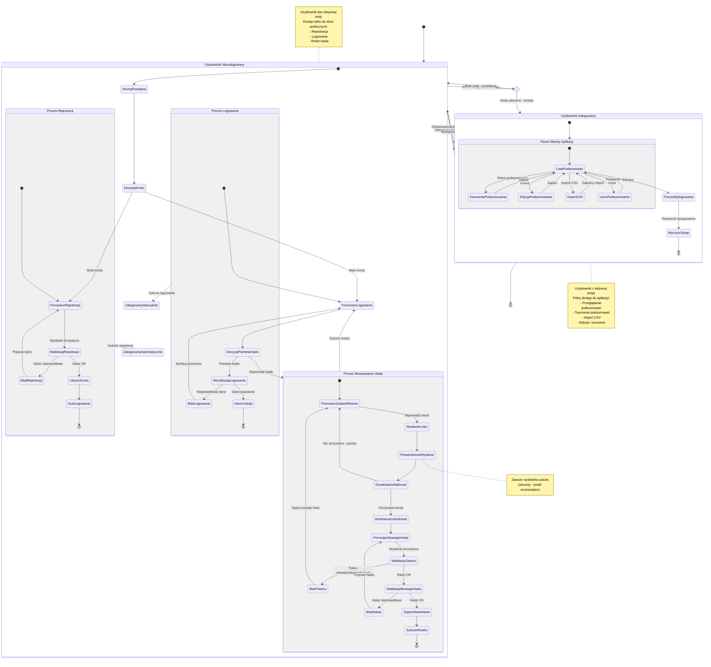

# Diagram Podróży Użytkownika - Moduł Autentykacji
## Apriary Summary - Ścieżki Użytkownika i Stany Aplikacji

**Data utworzenia:** 2025-12-01
**Wersja:** 1.0

---

## Analiza Podróży Użytkownika

### Główne Podróże Użytkownika

#### 1. Podróż Nowego Użytkownika (First-Time User Journey)

**Punkt wyjścia:** Użytkownik odwiedza aplikację po raz pierwszy

**Kroki:**
1. Lądowanie na stronie powitalnej z formularzem rejestracji
2. Wypełnienie formularza (email, hasło, potwierdzenie hasła)
3. Walidacja danych przez system
4. Automatyczne zalogowanie po pomyślnej rejestracji
5. Przekierowanie do panelu głównego z listą podsumowań

**Punkty decyzyjne:**
- Czy dane są poprawne? (email format, długość hasła, zgodność haseł)
- Czy email jest unikalny?

**Możliwe problemy:**
- Email już istnieje → Sugestia przejścia do logowania
- Hasła nie pasują → Poprawienie formularza
- Hasło za krótkie → Komunikat o wymaganiach

**Cel biznesowy:** Maksymalizacja konwersji nowych użytkowników
**Cel użytkownika:** Szybki dostęp do funkcjonalności aplikacji

#### 2. Podróż Powracającego Użytkownika (Returning User Journey)

**Punkt wyjścia:** Użytkownik ma już konto i chce się zalogować

**Kroki:**
1. Przejście do strony logowania (z landing page lub bezpośrednio)
2. Wypełnienie credentials (email, hasło)
3. Weryfikacja przez system
4. Utworzenie sesji
5. Przekierowanie do panelu głównego

**Punkty decyzyjne:**
- Czy credentials są poprawne?
- Czy użytkownik pamięta hasło?

**Możliwe problemy:**
- Nieprawidłowe dane → Możliwość ponowienia próby
- Zapomniał hasła → Przejście do procesu resetowania

**Cel biznesowy:** Minimalizacja friction przy powrocie do aplikacji
**Cel użytkownika:** Szybki dostęp do swoich danych

#### 3. Podróż Odzyskiwania Dostępu (Password Recovery Journey)

**Punkt wyjścia:** Użytkownik zapomniał hasła

**Kroki:**
1. Kliknięcie "Forgot password?" na stronie logowania
2. Wypełnienie formularza z emailem
3. Otrzymanie potwierdzenia o wysłaniu linku (zawsze, security)
4. Sprawdzenie skrzynki pocztowej
5. Kliknięcie linku resetującego z emaila
6. Wypełnienie formularza nowego hasła
7. Walidacja tokenu i nowego hasła
8. Potwierdzenie sukcesu
9. Przejście do logowania z nowym hasłem

**Punkty decyzyjne:**
- Czy token jest ważny? (nie wygasł, nie został użyty)
- Czy nowe hasło spełnia wymagania?
- Czy hasła się zgadzają?

**Możliwe problemy:**
- Token wygasł → Żądanie nowego linku
- Token już użyty → Żądanie nowego linku
- Nie otrzymał emaila → Możliwość ponowienia żądania

**Cel biznesowy:** Minimalizacja utraty użytkowników przez zapomnienie hasła
**Cel użytkownika:** Odzyskanie dostępu do konta

#### 4. Podróż Pracy z Aplikacją (Working Session Journey)

**Punkt wyjścia:** Użytkownik jest zalogowany

**Kroki:**
1. Przeglądanie listy podsumowań
2. Wykonywanie operacji:
   - Tworzenie nowego podsumowania
   - Import CSV z obserwacjami
   - Edycja istniejących podsumowań
   - Usuwanie podsumowań
   - Akceptacja podsumowań AI
3. Wylogowanie po zakończeniu pracy

**Punkty decyzyjne:**
- Czy sesja jest aktywna?
- Jaką operację użytkownik chce wykonać?

**Możliwe problemy:**
- Sesja wygasła → Przekierowanie do logowania
- Brak uprawnień → Komunikat błędu

**Cel biznesowy:** Dostarczenie wartości przez główną funkcjonalność
**Cel użytkownika:** Efektywne zarządzanie dokumentacją pasieki

#### 5. Podróż Zakończenia Sesji (Logout Journey)

**Punkt wyjścia:** Użytkownik chce się wylogować

**Kroki:**
1. Kliknięcie przycisku "Logout" w headerze
2. Wyczyszczenie sesji przez system
3. Przekierowanie do strony logowania
4. Stan niezalogowany

**Cel biznesowy:** Bezpieczne zakończenie sesji
**Cel użytkownika:** Ochrona swojego konta

---

## Stany Aplikacji i Przejścia

### Stan: Użytkownik Niezalogowany

**Charakterystyka:**
- Brak aktywnej sesji (cookie)
- Ograniczony dostęp tylko do stron publicznych
- Nie może korzystać z głównej funkcjonalności

**Dostępne akcje:**
- Rejestracja nowego konta
- Logowanie do istniejącego konta
- Rozpoczęcie procesu resetowania hasła
- Próba dostępu do chronionego zasobu (przekierowanie do logowania)

**Podstany:**
1. **Strona powitalna / Rejestracja**
   - Domyślny punkt wejścia dla nowych użytkowników
   - Formularz z polami: email, password, password-confirm
   - Link do logowania dla użytkowników z kontem

2. **Strona logowania**
   - Formularz z polami: email, password
   - Link "Forgot password?"
   - Link do rejestracji

3. **Proces resetowania hasła**
   - Formularz żądania resetu (email)
   - Potwierdzenie wysłania emaila
   - Formularz nowego hasła (po kliknięciu linku)
   - Potwierdzenie sukcesu resetu

### Stan: Użytkownik Zalogowany

**Charakterystyka:**
- Aktywna sesja (encrypted cookie z :uid)
- Pełny dostęp do aplikacji
- Widoczny header z opcją wylogowania

**Dostępne akcje:**
- Przeglądanie listy podsumowań
- Tworzenie nowych podsumowań
- Edycja istniejących podsumowań
- Usuwanie podsumowań
- Import CSV
- Akceptacja podsumowań AI
- Wylogowanie

**Podstany:**
1. **Lista podsumowań** (główny widok)
   - Domyślny widok po zalogowaniu
   - Wyświetlanie wszystkich podsumowań użytkownika
   - Przyciski akcji (nowe, edytuj, usuń, akceptuj)
   - Sekcja importu CSV

2. **Tworzenie podsumowania**
   - Formularz z polami: hive-number, observation-date, special-feature, content
   - Walidacja po stronie klienta i serwera
   - Powrót do listy po zapisaniu

3. **Edycja podsumowania**
   - Inline edit dla metadanych
   - Rozszerzony formularz dla contentu
   - Natychmiastowy zapis zmian

4. **Import CSV**
   - Upload pliku CSV
   - Generowanie podsumowań przez AI
   - Wyświetlanie wyników importu

---

## Punkty Decyzyjne

### 1. Decyzja: Czy użytkownik ma konto?
**Lokalizacja:** Strona powitalna
**Opcje:**
- **NIE** → Pozostaje na formularzu rejestracji
- **TAK** → Przechodzi do logowania

**Impact:** Określa początkowy przepływ użytkownika

### 2. Decyzja: Walidacja danych rejestracji
**Lokalizacja:** Po wysłaniu formularza rejestracji
**Kryteria:**
- Format email (regex)
- Długość hasła (min 8 znaków)
- Zgodność haseł (password === password-confirm)
- Unikalność emaila

**Opcje:**
- **Dane nieprawidłowe** → Powrót do formularza z komunikatem błędu
- **Dane poprawne** → Utworzenie konta + automatyczne logowanie

**Impact:** Jakość danych użytkowników, UX onboardingu

### 3. Decyzja: Czy użytkownik pamięta hasło?
**Lokalizacja:** Strona logowania
**Opcje:**
- **TAK** → Próba logowania
- **NIE** → Przejście do resetowania hasła

**Impact:** Retention użytkowników, którzy zapomnieli hasła

### 4. Decyzja: Weryfikacja credentials przy logowaniu
**Lokalizacja:** Po wysłaniu formularza logowania
**Kryteria:**
- Czy email istnieje w systemie
- Czy hasło jest poprawne (BCrypt verify)

**Opcje:**
- **Credentials nieprawidłowe** → Komunikat błędu, możliwość ponowienia
- **Credentials poprawne** → Utworzenie sesji, przekierowanie do panelu

**Impact:** Bezpieczeństwo systemu, UX logowania

### 5. Decyzja: Walidacja tokenu resetującego
**Lokalizacja:** Po kliknięciu linku z emaila
**Kryteria:**
- Czy token istnieje w bazie
- Czy token nie wygasł (< 1 godzina)
- Czy token nie został już użyty

**Opcje:**
- **Token nieważny** → Komunikat błędu, sugestia żądania nowego linku
- **Token ważny** → Możliwość ustawienia nowego hasła

**Impact:** Bezpieczeństwo procesu resetu, UX odzyskiwania dostępu

### 6. Decyzja: Walidacja nowego hasła
**Lokalizacja:** Po wysłaniu formularza nowego hasła
**Kryteria:**
- Długość hasła (min 8 znaków)
- Zgodność haseł (password === password-confirm)

**Opcje:**
- **Hasło nieprawidłowe** → Powrót do formularza z błędem
- **Hasło poprawne** → Zapisanie nowego hasła, potwierdzenie sukcesu

**Impact:** Bezpieczeństwo kont użytkowników

### 7. Decyzja: Czy użytkownik ma aktywną sesję?
**Lokalizacja:** Middleware przy każdym żądaniu do chronionego zasobu
**Kryteria:**
- Obecność :uid w sesji

**Opcje:**
- **Brak sesji** → Przekierowanie do /signin?error=not-signed-in
- **Sesja aktywna** → Dostęp do zasobu

**Impact:** Bezpieczeństwo danych, wymuszenie logowania

---

## Diagram Stanu (State Diagram)

---

## Metryki Podróży Użytkownika

### 1. Funnel Rejestracji
**Kroki:**
1. Wizyta na stronie powitalnej (100%)
2. Rozpoczęcie wypełniania formularza (X%)
3. Wysłanie formularza (Y%)
4. Pomyślna rejestracja (Z%)

**Kluczowe wskaźniki:**
- Conversion rate: Z/100
- Drop-off rate na każdym kroku
- Najczęstsze błędy walidacji

### 2. Funnel Logowania
**Kroki:**
1. Wizyta na stronie logowania (100%)
2. Wysłanie credentials (X%)
3. Pomyślne logowanie (Y%)

**Kluczowe wskaźniki:**
- Success rate: Y/X
- Failed login attempts per user
- Time to successful login

### 3. Funnel Resetowania Hasła
**Kroki:**
1. Kliknięcie "Forgot password?" (100%)
2. Wysłanie emaila (X%)
3. Kliknięcie linku z emaila (Y%)
4. Ustawienie nowego hasła (Z%)
5. Pomyślne logowanie z nowym hasłem (W%)

**Kluczowe wskaźniki:**
- Completion rate: W/100
- Email open rate: Y/X
- Average time to complete reset

### 4. Engagement w Aplikacji
**Metryki:**
- Średni czas sesji
- Liczba akcji na sesję
- Najczęściej używane funkcje
- Return rate (powroty w ciągu 7 dni)

---

## Optymalizacje UX

### 1. Redukcja Friction przy Rejestracji
**Problem:** Długi formularz zniechęca użytkowników
**Rozwiązanie MVP:** Minimalne wymagania (email + password + confirm)
**Przyszłe ulepszenia:**
- Password strength indicator
- Real-time validation feedback
- Social auth (Google, GitHub)

### 2. Ułatwienie Logowania
**Problem:** Zapominanie credentials
**Rozwiązanie MVP:** Łatwy proces resetowania hasła
**Przyszłe ulepszenia:**
- "Remember me" checkbox
- Biometric auth na mobile
- Magic link login (passwordless)

### 3. Jasna Komunikacja Błędów
**Problem:** Niejasne komunikaty błędów
**Rozwiązanie MVP:** Szczegółowe, przyjazne komunikaty
**Przykłady:**
- "Invalid email address" zamiast "Error 400"
- "Passwords do not match" z highlightem pól
- "Password must be at least 8 characters" z licznikiem

### 4. Bezpieczeństwo bez Utraty UX
**Problem:** Security vs. usability trade-off
**Rozwiązanie MVP:**
- Email enumeration prevention (zawsze sukces)
- Constant-time password verification
- Ekspresyjne komunikaty (nie "user not found", ale "invalid credentials")

---

## Scenariusze Edge Case

### 1. Użytkownik próbuje zarejestrować się z istniejącym emailem
**Zachowanie:** Redirect z błędem "email-exists" + sugestia logowania
**Cel:** Pomoc użytkownikowi w dotarciu do celu (dostęp do aplikacji)

### 2. Użytkownik klika stary link resetujący
**Zachowanie:** Komunikat o wygaśnięciu + przycisk "Request new link"
**Cel:** Minimalizacja frustracji, jasna ścieżka naprawy

### 3. Użytkownik próbuje dostać się do /summaries bez logowania
**Zachowanie:** Redirect do /signin?error=not-signed-in
**Cel:** Wymuszenie autentykacji, zachowanie requested URL (future)

### 4. Sesja użytkownika wygasa podczas pracy
**Zachowanie MVP:** Redirect do logowania przy kolejnym żądaniu
**Future:** Modal z opcją re-login bez utraty danych

### 5. Użytkownik nie otrzymuje emaila resetującego
**Zachowanie:** Możliwość ponowienia żądania, sugestia sprawdzenia spamu
**Przyszłość:** Support contact, alternatywne metody weryfikacji

---

**Koniec dokumentu**
