# Diagram Architektury UI - Moduł Autentykacji
## Apriary Summary - System Rejestracji, Logowania i Resetowania Hasła

**Data utworzenia:** 2025-12-01
**Wersja:** 1.0

---

## Analiza Architektury

### Komponenty systemu autentykacji

#### Istniejące komponenty (przed zmianami):

**Layouty:**
- `ui/base-html` - bazowa struktura HTML z meta tagami, CSS, JS
- `ui.layout/base-html` - bazowa struktura HTML (wersja rozszerzona)
- `ui.layout/app-page` - layout dla zalogowanych użytkowników z headerem i powiadomieniami
- `ui/page` - prosty layout dla stron niezalogowanych

**Komponenty nagłówka:**
- `ui.header/application-header` - nagłówek dla zalogowanych (Logout, New Summary)

**Komponenty powiadomień:**
- `ui.toast/toast-container` - kontener na powiadomienia toast
- `ui.toast/toast-html` - pojedyncze powiadomienie
- `ui.error/error-message-area` - wyświetlanie błędów na poziomie strony

**Strony autentykacji:**
- `pages.home/home-page` - strona rejestracji (/)
- `pages.home/signin-page` - strona logowania (/signin)

**Strony aplikacji:**
- `pages.app/app` - przekierowanie do /summaries
- `pages.summaries-view/summaries-list-page` - główna strona aplikacji
- `pages.summaries-view/new-summary-page` - formularz nowego podsumowania

#### Nowe komponenty (według specyfikacji):

**Strony autentykacji:**
- `pages.home/forgot-password-page` - żądanie resetowania hasła (/forgot-password)
- `pages.home/password-reset-sent-page` - potwierdzenie wysłania emaila (/password-reset-sent)
- `pages.home/reset-password-page` - ustawienie nowego hasła (/reset-password?token=xxx)
- `pages.home/password-reset-success-page` - potwierdzenie resetu (/password-reset-success)

**Komponenty nagłówka:**
- `ui.header/unauthenticated-header` - nagłówek dla niezalogowanych (Sign In / Sign Up)

**Moduły backendowe:**
- `email/send-password-reset-email` - wysyłka emaili resetujących hasło
- `auth/send-password-reset` - handler dla żądania resetu
- `auth/reset-password` - handler dla ustawienia nowego hasła

#### Zaktualizowane komponenty:

**Strony:**
- `pages.home/home-page` - **DODANO** pole potwierdzenia hasła, walidacja dopasowania
- `pages.home/signin-page` - **DODANO** link "Forgot password?"

**Layouty:**
- `ui/page` lub `ui.layout/page` - **DODANO** warunkowe wyświetlanie unauthenticated-header

### Główne przepływy użytkownika

#### 1. Przepływ Rejestracji (Sign Up):
```
Użytkownik → / (home-page)
  → Wypełnia formularz (email, password, password-confirm)
  → POST /auth/signup
  → Backend waliduje (email format, password length, password match)
  → [Sukces] Tworzenie użytkownika + sesja → Redirect /app → /summaries
  → [Błąd] Redirect /?error=code → Wyświetlenie błędu
```

#### 2. Przepływ Logowania (Sign In):
```
Użytkownik → /signin (signin-page)
  → Wypełnia formularz (email, password)
  → POST /auth/signin
  → Backend weryfikuje credentials (BCrypt)
  → [Sukces] Tworzenie sesji → Redirect /app → /summaries
  → [Błąd] Redirect /signin?error=code → Wyświetlenie błędu
```

#### 3. Przepływ Resetowania Hasła (Password Reset):
```
Użytkownik → /signin
  → Klika "Forgot password?"
  → /forgot-password (forgot-password-page)
  → Wypełnia email
  → POST /auth/send-password-reset
  → Backend generuje token (SHA-256 hash)
  → Wysyła email przez Postmark
  → Redirect /password-reset-sent (zawsze - security)

Użytkownik otrzymuje email:
  → Klika link z tokenem
  → /reset-password?token=xxx (reset-password-page)
  → Wypełnia nowe hasło + potwierdzenie
  → POST /auth/reset-password
  → Backend waliduje token (exists, not expired, not used)
  → [Sukces] Update hasła + oznaczenie tokenu → Redirect /password-reset-success
  → [Błąd] Redirect /reset-password?token=xxx&error=code

Użytkownik → /password-reset-success
  → Klika "Sign in"
  → /signin
```

#### 4. Nawigacja Warunkowa:
```
Request → Middleware sprawdza sesję
  → Jeśli zalogowany:
    → Używa app-page layout
    → Wyświetla application-header (Logout, New Summary)
    → Dostęp do /summaries, /summaries-new
  → Jeśli niezalogowany:
    → Używa page layout
    → Wyświetla unauthenticated-header (Sign In, Sign Up)
    → Dostęp do /, /signin, /forgot-password, /reset-password
```

### Odpowiedzialności komponentów

#### Warstwa Prezentacji (Strony):
- Renderowanie formularzy HTML
- Wyświetlanie błędów walidacji z backendu
- Podstawowa walidacja po stronie klienta (opcjonalna)
- Nawigacja między stronami
- Submit danych do endpointów backend

#### Warstwa Layoutów:
- `base-html`: Struktura HTML, ładowanie CSS/JS, meta tagi
- `app-page`: Layout zalogowanych - header + toast + error area + content
- `page`: Layout niezalogowanych - prosty wrapper z opcjonalnym headerem

#### Warstwa Komponentów:
- `application-header`: Nawigacja zalogowanych - logo, akcje, logout
- `unauthenticated-header`: Nawigacja niezalogowanych - logo, sign in/up
- `toast-container`: Kontener powiadomień (fixed top-right)
- `error-message-area`: Wyświetlanie błędów krytycznych

#### Warstwa Backendowa:
- Walidacja wszystkich inputów (nigdy nie ufaj klientowi)
- Hashowanie haseł (BCrypt)
- Generowanie i walidacja tokenów resetujących
- Wysyłka emaili
- Zarządzanie sesjami
- Operacje bazodanowe

---

## Diagram Mermaid

```mermaid
flowchart TD
    subgraph "Warstwa Layoutów"
        BaseHTML["base-html<br/><small>Struktura HTML, CSS, JS</small>"]
        AppPage["app-page<br/><small>Layout zalogowanych</small>"]
        SimplePage["page<br/><small>Layout niezalogowanych</small>"]
    end

    subgraph "Komponenty Nawigacji"
        AuthHeader["application-header<br/><small>Header zalogowanych</small><br/>Logout | New Summary"]
        UnauthHeader["unauthenticated-header<br/><small>Header niezalogowanych</small><br/>Sign In | Sign Up"]:::updated
    end

    subgraph "Komponenty Powiadomień"
        ToastContainer["toast-container<br/><small>Kontener powiadomień</small>"]
        ToastHTML["toast-html<br/><small>Pojedyncze powiadomienie</small>"]
        ErrorArea["error-message-area<br/><small>Błędy na poziomie strony</small>"]
    end

    subgraph "Strony Autentykacji - Niezalogowane"
        SignUpPage["home-page<br/><small>Rejestracja (/)</small><br/>email, password, <b>password-confirm</b>"]:::updated
        SignInPage["signin-page<br/><small>Logowanie (/signin)</small><br/>email, password<br/><b>+ Forgot password?</b>"]:::updated
        ForgotPage["forgot-password-page<br/><small>Żądanie resetu</small><br/>email"]:::new
        ResetSentPage["password-reset-sent-page<br/><small>Potwierdzenie wysłania</small>"]:::new
        ResetPage["reset-password-page<br/><small>Nowe hasło</small><br/>password, password-confirm, token"]:::new
        ResetSuccessPage["password-reset-success-page<br/><small>Sukces resetu</small>"]:::new
    end

    subgraph "Strony Aplikacji - Zalogowane"
        SummariesPage["summaries-list-page<br/><small>Lista podsumowań</small>"]
        NewSummaryPage["new-summary-page<br/><small>Nowe podsumowanie</small>"]
        SummariesList["summaries-list-section<br/><small>Komponenty listy</small>"]
        SummaryCard["summary-card<br/><small>Karta podsumowania</small>"]
        CSVImport["csv-import-section<br/><small>Import CSV</small>"]
    end

    subgraph "Moduły Backendowe"
        AuthModule["auth module"]
        SignupHandler["signup handler<br/><small>+ password-confirm validation</small>"]:::updated
        SigninHandler["signin handler"]
        SendResetHandler["send-password-reset handler<br/><small>generowanie tokenu</small>"]:::new
        ResetHandler["reset-password handler<br/><small>walidacja tokenu, update</small>"]:::new
        EmailModule["email module<br/><small>wysyłka emaili</small>"]:::new
    end

    subgraph "Middleware i Sesje"
        SessionMiddleware["wrap-session<br/><small>Zarządzanie sesją</small>"]
        SignedInMiddleware["wrap-signed-in<br/><small>Ochrona tras</small>"]
        RedirectMiddleware["wrap-redirect-signed-in<br/><small>Przekierowanie zalogowanych</small>"]
    end

    subgraph "Baza Danych"
        UserSchema["user schema<br/><small>email, password-hash</small>"]
        TokenSchema["password-reset-token schema<br/><small>token, user-id, expires-at</small>"]:::new
    end

    %% Relacje Layoutów
    SimplePage --> BaseHTML
    AppPage --> BaseHTML
    SimplePage --> UnauthHeader
    AppPage --> AuthHeader
    AppPage --> ToastContainer
    AppPage --> ErrorArea
    ToastContainer --> ToastHTML

    %% Strony Niezalogowane → Layout
    SignUpPage --> SimplePage
    SignInPage --> SimplePage
    ForgotPage --> SimplePage
    ResetSentPage --> SimplePage
    ResetPage --> SimplePage
    ResetSuccessPage --> SimplePage

    %% Strony Zalogowane → Layout
    SummariesPage --> AppPage
    NewSummaryPage --> AppPage
    SummariesPage --> SummariesList
    SummariesPage --> CSVImport
    SummariesList --> SummaryCard

    %% Przepływ Rejestracji
    SignUpPage -->|"POST /auth/signup"| SignupHandler
    SignupHandler -->|walidacja| UserSchema
    SignupHandler -->|sukces| SessionMiddleware
    SignupHandler -->|błąd| SignUpPage

    %% Przepływ Logowania
    SignInPage -->|"POST /auth/signin"| SigninHandler
    SigninHandler -->|weryfikacja| UserSchema
    SigninHandler -->|sukces| SessionMiddleware
    SigninHandler -->|błąd| SignInPage

    %% Przepływ Resetowania Hasła
    SignInPage -.->|"link Forgot?"| ForgotPage
    ForgotPage -->|"POST /auth/send-password-reset"| SendResetHandler
    SendResetHandler -->|generuj token| TokenSchema
    SendResetHandler -->|wyślij email| EmailModule
    SendResetHandler -->|zawsze| ResetSentPage
    EmailModule -.->|"link w emailu"| ResetPage
    ResetPage -->|"POST /auth/reset-password"| ResetHandler
    ResetHandler -->|waliduj| TokenSchema
    ResetHandler -->|update| UserSchema
    ResetHandler -->|sukces| ResetSuccessPage
    ResetHandler -->|błąd| ResetPage

    %% Nawigacja między stronami
    SignUpPage -.->|"link Sign in"| SignInPage
    SignInPage -.->|"link Sign up"| SignUpPage
    ResetSentPage -.->|"link"| SignInPage
    ResetSuccessPage -.->|"link"| SignInPage

    %% Middleware
    SessionMiddleware -->|"redirect to"| SummariesPage
    SignedInMiddleware -->|chroni| SummariesPage
    SignedInMiddleware -->|chroni| NewSummaryPage
    RedirectMiddleware -->|chroni| SignUpPage
    RedirectMiddleware -->|chroni| SignInPage

    %% Backend Module
    AuthModule --> SignupHandler
    AuthModule --> SigninHandler
    AuthModule --> SendResetHandler
    AuthModule --> ResetHandler

    %% Style
    classDef updated fill:#fff4e6,stroke:#fb923c,stroke-width:3px
    classDef new fill:#dcfce7,stroke:#22c55e,stroke-width:3px
```



---

## Legenda

- **Pomarańczowe obramowanie** - Komponenty zaktualizowane (dodano nowe funkcjonalności do istniejących)
- **Zielone obramowanie** - Komponenty całkowicie nowe
- **Białe tło** - Komponenty istniejące bez zmian
- **Strzałki ciągłe** (→) - Przepływ danych, renderowania, lub wywołania funkcji
- **Strzałki kropkowane** (-.→) - Nawigacja użytkownika przez linki

---

## Kluczowe Punkty Integracji

### 1. Warunkowe Renderowanie Headera
```clojure
;; W ui/page lub ui.layout/page
(defn page [ctx & body]
  (base-html
   ctx
   {}
   (when-not (:uid (:session ctx))
     (unauthenticated-header ctx))  ;; NOWY komponent
   body))
```

### 2. Ochrona Tras przez Middleware
```clojure
;; Trasy niezalogowane
[["/" {:middleware [mid/wrap-redirect-signed-in]}
  ["" {:get home-page}]]
 ["/signin" {:get signin-page}]
 ["/forgot-password" {:get forgot-password-page}]]  ;; NOWA

;; Trasy zalogowane
[["/summaries" {:middleware [mid/wrap-signed-in]}
  ["" {:get summaries-list-page}]]]
```

### 3. Przepływ Błędów
```clojure
;; Backend zwraca redirect z kodem błędu
{:status 303
 :headers {"location" "/?error=password-mismatch"}}

;; Frontend renderuje błąd
(when-some [error (:error params)]
  [:div.error
   (case error
     "password-mismatch" "Passwords do not match"
     ...)])
```

### 4. Email Integration
```clojure
;; W send-password-reset handler
(when user
  (let [token (generate-secure-token)
        reset-link (str base-url "/reset-password?token=" token)]
    (send-password-reset-email ctx email reset-link)))
```

---

## Mapowanie URL → Komponenty

| URL | Komponent | Layout | Header | Status |
|-----|-----------|--------|--------|--------|
| `/` | `home-page` | `page` | `unauthenticated-header` | Zaktualizowany |
| `/signin` | `signin-page` | `page` | `unauthenticated-header` | Zaktualizowany |
| `/forgot-password` | `forgot-password-page` | `page` | `unauthenticated-header` | **Nowy** |
| `/password-reset-sent` | `password-reset-sent-page` | `page` | `unauthenticated-header` | **Nowy** |
| `/reset-password` | `reset-password-page` | `page` | `unauthenticated-header` | **Nowy** |
| `/password-reset-success` | `password-reset-success-page` | `page` | `unauthenticated-header` | **Nowy** |
| `/app` | `app` (redirect) | - | - | Bez zmian |
| `/summaries` | `summaries-list-page` | `app-page` | `application-header` | Bez zmian |
| `/summaries-new` | `new-summary-page` | `app-page` | `application-header` | Bez zmian |

---

**Koniec dokumentu**
