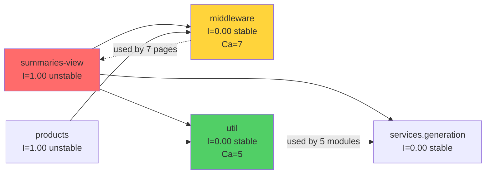

# Apriary — Mapa Repo (Onboarding)

**Dla kogo:** Nowy developer wprowadzany do projektu  
**Cel:** 15 minut czytania → rozumiesz gdzie rzeczy żyją, co jest niebezpieczne, od czego zacząć  
**Data:** 2026-06-10  
**Okno analizy:** Ostatnie 12 miesięcy (2025-11-22 do 2026-06-08)

---

## TL;DR — 7 zdań

**Apriary** to MVP do automatyzacji podsumowań pracy pasiecznej, zbudowane w Clojure (Biff framework v1.9.0 + XTDB). Projekt żyje od listopada 2025, rozwijany przez jednego developera (Konrad Szydlo) przez 7 aktywnych miesięcy z 3-miesięczną przerwą Q1 2026. Architektura jest **czysta** (zero cykli zależności), **pages-driven** (pages integrują UI + services + XTDB), z **dwoma głównymi domenami**: **summaries** (legacy, feature-complete Q4 2025) i **products** (frontier, active Q2 2026). Największe ryzyko: `summaries_view.clj` — **God Page** z 19 zależnościami, 9 zmianami w Q4, testing nightmare. Q2 2026 był **test pivot**: ratio zmienił się z 1:4.9 (ship fast) na 1.4:1 (test-first), phased rollout, hooks — ale **frontend validation** i **E2E testing** dalej brakuje. Services layer jest **perfekcyjnie izolowany** (Ca=0 Ce=0), middleware **stabilny ale krytyczny** (Ca=7), `schema.api` to **ghost architecture** (132 linie, zero użyć).

### Warstwy Systemu

```mermaid
graph TD
    Pages[Pages Layer<br/>pages/summaries_view.clj 9 zmian<br/>pages/products.clj 4 zmiany Q2]
    UI[UI Components<br/>100% coupled do pages<br/>nie-reusable]
    Services[Services Layer<br/>Perfect isolation Ca=0 Ce=0<br/>Best test coverage 63%]
    DB[(XTDB<br/>Bitemporal DB<br/>16/36 ns ma dependency)]
    Core[Core Hub<br/>apriary.clj<br/>Routing + middleware<br/>6/8 multi-area commits]
    Schema[schema.api<br/>132 linie ORPHAN<br/>zero importów]
    
    Pages -->|63%| UI
    Pages -->|37%| Core
    Pages -->|32%| Services
    Services --> DB
    UI -.-> Core
    Pages -.x Schema
    
    style Pages fill:#ff6b6b
    style Services fill:#51cf66
    style Schema fill:#868e96
    style Core fill:#ffd43b
```

**Czerwony** (Pages): Hot zones, wysokie ryzyko zmian  
**Zielony** (Services): Stabilne, dobrze testowane, bezpieczne do modyfikacji  
**Szary** (schema.api): Orphan code, planned ale not integrated  
**Żółty** (Core): Hub, blast radius Ca=7, zmiany wpływają na wszystko

---

## Teren — Gdzie Skupia Się Praca

### Duża Odpowiedzialność vs Peryferia

**TOP 3 Hot Zones (ostatnie 12 miesięcy):**

| Moduł | Zmiany | Status | Dlaczego Gorące |
|-------|--------|--------|-----------------|
| **pages/** | 28 | 🔥 Epicentrum | Presentation layer, 63%→UI, 37%→core, 32%→services |
| **ui/** | 26 | 🔥 Active | 100% coupled do pages, page-specific components |
| **test/services/** | 21 | 🧪 Test surge | Q2 test pivot, retroactive coverage |

**Absolutny hotspot:** `pages/summaries_view.clj` — **9 zmian** w Q4 2025, 32% wszystkich top-3 zmian w jednym pliku.

**Peryferia (cold zones):**
- `services/` — 15 zmian total, ale **rozproszone** (7 plików), niska aktywność per-file
- `middleware.clj`, `util.clj`, `schema.clj` — infrastruktura, stabilna, rzadko dotykana
- `auth.clj` — jednorazowa implementacja Q4, zero zmian Q2

### Moduły Głębokie vs Płytkie

**Głębokie (wysokie sprzężenie, wiele zależności):**

```
summaries_view.clj (19 deps total):
  ├─ 7 external (XTDB, Rum, Malli×2, Cheshire, logging)
  └─ 12 internal:
      ├─ services/ (4): summary, csv-import, openrouter, generation
      ├─ ui/ (6): layout, helpers, csv-import, summary-card, summaries-list, util
      ├─ dto/ (1): dto.summary
      └─ infrastructure (1): middleware
```

**Testability Score: 🔴 25** (najbardziej niebezpieczny moduł do testowania — wymaga 7-10 mocków per handler × 16 handlers).

**Płytkie (niezależne, łatwe do testowania):**

```
services/generation.clj (3 deps):
  └─ XTDB, clojure.string, logging (zero internal)
  
util.clj (1 dep):
  └─ clojure.string (pure functions)
  
Testability Score: 🟢 4-16 (unit testing sensowne)
```

**Struktura katalogów vs Realna Aktywność:**

Katalogi sugerują równomierny rozkład, ale **aktywność jest skoncentrowana**:
- `pages/` ma 8 plików, ale **summaries_view** = 9/28 zmian (32% aktywności modułu)
- `ui/` ma 10 plików, ale **header + summaries_list + summary_card** = 15/26 zmian (58%)
- `services/` ma 7 plików, **równomierny** rozkład (2-3 zmiany per plik)

### Aktywność w Czasie — Timeline Trzech Faz

```
Q4 2025 (Nov-Dec)      Q1 2026 (Jan-Mar)      Q2 2026 (Apr-Jun)
32 commits             0 commits              53 commits
════════════════════   ══════════════════     ══════════════════
🚀 Feature Sprint      ❄️ 3-month gap         🧪 Test Hardening
Summaries domain       Context loss?          Products pivot
Ship fast (1:4.9)      -                      Test-first (1.4:1)
  
27.11: +722 linie      -                      01.06: Products +900
  (summaries_view      -                        (new domain)
   w jednym dniu)      -                      05.06: +510 test lines
                                                (18 commits, phased rollout)
```

**Wzorzec:** Sprint → Pause → Pivot → Harden

**Q4 focus:** Summaries (summaries_view 9 zmian, header 6, summaries_list 5)  
**Q2 focus:** Products (products 4 zmiany, product_csv 2, product_rankings 2) + Test backfill (summaries_view_test 4, products_test 4)

**Wniosek:** Summaries domain jest **legacy** (stabilny, Q4 feature-complete, Q2 tylko testy). Products domain jest **frontier** (aktywny development Q2, może mieć gaps).

---

## Realne Powiązania — Co Zmienia Się Razem

### Coupling Analysis — Z Historii Git

**TOP 3 Najsilniejsze Sprzężenia (co-commits):**

| Para | Commits | % overlap | Pattern | Źródło |
|------|---------|-----------|---------|--------|
| **pages ↔ ui** | 12 | 100% (ui→pages) | 🔥 UI components page-specific | Git history |
| **pages ↔ core** | 7 | 37% (pages→core) | 🎯 Routing integration | Git history |
| **pages ↔ services** | 6 | 32% (pages→service) | 🔄 Business logic wiring | Git history |

**Interpretacja:**

1. **pages + ui (100% overlap)** — **Każda** zmiana w UI dotyka pages. Zero standalone components. UI to nie reusable library, to page-specific helpers. Zmiana w `ui/summary_card.clj` = sprawdź `summaries_view.clj` context.

2. **pages + core (37% overlap)** — Każdy nowy page = update `apriary.clj` routing table. 7/7 commitów to **nowe features/endpointy**, nie fixes. Core to infrastructure hub, nie business logic.

3. **pages + services (32% overlap)** — 2/3 pages changes **NIE** dotyka services. Services są relatywnie izolowane od presentation. Można zmienić UI bez touching services (good separation).

### Dependency Graph — Z Analizy Struktury

**From clj-kondo analysis (artifact-2):**



**I=Instability (Ce / (Ca + Ce)):**
- **I=1.00** (pages): Maksymalnie unstable = łatwo zmieniać (tylko one zależą, nikt od nich nie zależy)
- **I=0.00** (middleware, util): Maksymalnie stable = trudno zmieniać (wiele modułów zależy)

**Ca=Afferent Coupling (ile innych modułów mnie importuje):**
- **Ca=7** (middleware): Używany przez wszystkie pages — zmiana = sprawdź 7 plików
- **Ca=5** (util): Używany przez wiele modułów — must be bulletproof (100% test coverage target)

### Cykle Zależności

✅ **Zero cykli** — acykliczna architektura (z clj-kondo + Tarjan's algorithm).

**Znaczenie:** Dependencies flow w jednym kierunku → łatwiejsze reasoning, izolowane testowanie, mniejsze ryzyko cascade failures. Typowe legacy często ma cycles UI ↔ Services ↔ Data (tutaj brak).

**Źródło:** Analiza clj-kondo (artifact-2, dependency-summary.md).

### Gdzie Graf Zależności NIE Pokazuje Prawdy

**1. Test coupling (niska):**

Z git history:
- **Services + test_services:** 5/8 (63%) — dobra praktyka
- **UI + test_ui:** 2/12 (17%) — słabe
- **Pages + test_pages:** 3/19 (16%) — słabe

Graf importów pokazuje **zero** dependencies test → src (testy nie importują kodu?! — błąd). Real coupling z commitów: testy są pisane dla services, **nie** dla UI/pages.

**2. Schema.api phantom coupling:**

Graf pokazuje: `schema.api` istnieje, ma 132 linie Malli schemas.  
Git history pokazuje: **Zero importów** w całym projekcie. Orphan code.

`summaries_view.clj` ma **duplicate** `create-manual-summary-schema` (byte-for-byte copy).

**Wniosek:** Planned architecture ≠ Actual architecture. Schema.api był Q4 foundation plan, nigdy nie integrated (Q1 gap context loss?).

**3. Coupling przez regenerację:**

`deps.edn`, `package-lock.json`, `.ai/` docs — zmieniają się razem z features, ale to **generated/managed** files, nie ręczne edycje. Tańszy rodzaj sprzężenia (update = run command, nie manual refactor).

**Unknown coupling (brak grafu zależności):**

- **Frontend JS** (`resources/public/js/main.js`) — touched 2 razy, ale **nie ma** dependency graph (JS outside clj-kondo scope). Zmienia się z UI features, ale mechanizm coupling = `unknown`.
- **Tailwind CSS** (`resources/tailwind.css`) — 3 multi-area commits, łączy UI features przez global styles. Coupling = visual, nie code imports.

---

## Strefy Ryzyka — 6 Obszarów Wysokiego Ryzyka

### 1. 🔴 **God Page: `summaries_view.clj`**

**Dlaczego ryzykowne:**
- 19 dependencies (7 external + 12 internal) = testing nightmare
- 9 zmian Q4 2025 = absolutny hotspot
- 16 handlers w jednym pliku = monolith
- Vznikł przez +722 linie w jednym dniu (27.11.2025) — rapid feature dump

**Evidence:** 
- Testability score 🔴 25 (highest w projekcie)
- Unit testing = 7-10 mocks × 16 handlers = 112+ mock setups
- Bug fix "accepting cards" (72ed70f) touched 5 plików jednocześnie — integration hell

**Z czego wiemy:**
- Git history (artifact-1): 9 zmian, 32% top-3 aktywności
- Dependency analysis (artifact-2): 19 deps, I=1.00
- Contributor (artifact-3): Konrad napisał 100% w jednym dniu

### 2. 🟡 **Orphan Foundation: `schema.api`**

**Dlaczego ryzykowne:**
- 132 linie Malli schemas, **zero importów** w całym projekcie
- `summaries_view.clj` ma duplicate inline schema (drift risk)
- Products domain nie ma frontend validation w ogóle (quality regression)

**Evidence:**
- `grep -r "schema.api" src/` → zero hits
- `summaries_view.clj:334` = identyczny schema jak `schema.api:26-37`

**Z czego wiemy:**
- Dependency analysis (artifact-2): zero usage
- Git history (artifact-1): touched w Q4, nie adoptowany w Q2 products
- Contributor (artifact-3): Q1 gap context loss hypothesis

### 3. ⚠️ **Integration Hub: `apriary.clj`**

**Dlaczego ryzykowne:**
- Ca=7 (wszystkie pages zależą) = blast radius
- 6/8 commitów touching core to multi-area commits — zawsze z pages/services
- 8 zmian w ostatnim roku (WARM zone)

**Evidence:**
- Każdy nowy page/endpoint = routing update w apriary.clj
- Middleware setup = single point of failure

**Z czego wiemy:**
- Git coupling (artifact-1): 37% pages changes wymaga core update
- Stability metrics (artifact-2): I=0.00, Ca=7

### 4. ❌ **Frontend Validation Gap: Products Domain**

**Dlaczego ryzykowne:**
- 12.5% pages (1/8) ma frontend validation — tylko summaries
- Products, rankings, inne pages = backend-only validation (poor UX)
- Q2 test pivot nie obejmował frontend quality

**Evidence:**
- `grep -r "malli" src/com/apriary/pages` → tylko summaries_view
- Products active development (4 zmiany Q2) bez validation guards

**Z czego wiemy:**
- Layer boundaries analysis (artifact-2)
- Contributor (artifact-3): Q2 backend test focus, może być oversight

### 5. 🧪 **Test Coverage Gap: Integration + E2E**

**Dlaczego ryzykowne:**
- Pages integration tests = 0? (prawdopodobnie brak — 16% w-commit coverage)
- E2E tests = 0 (zero Playwright/Cypress setup)
- Services unit tests = good (63% w-commit), ale integration holes

**Evidence:**
- Q2 test pivot: 30 test changes, ale backend-only (services + schema)
- `test/com/apriary/pages/summaries_view_test.clj` = XSS tests tylko (czerwiec 5), nie integration

**Z czego wiemy:**
- Territory map (artifact-1): test/src ratio 1.4:1 w Q2, ale focus services
- Testability analysis (artifact-2): summaries-view testability 🔴 25
- Contributor (artifact-3): zero E2E commits, może być "later" priority

### 6. 🟡 **Q1 Gap Context Loss**

**Dlaczego ryzykowne:**
- 3-month gap (styczeń-kwiecień 2026) = potential context loss
- Schema.api orphaned po gap (nie było written pending work)
- Products nie follow summaries pattern (może nie być aware)

**Evidence:**
- Zero commits Q1 2026
- Q2 "fix repl loading" suggests "coming back after pause"
- Q2 workflow improvements (reviews, test-first) = fresh perspective, ale lost Q4 context

**Z czego wiemy:**
- Git timeline (artifact-1): 0 commits Q1
- Contributor (artifact-3): solo developer, może nie pamiętać detali po 5 miesiącach

---

## Kogo Zapytać — Per Strefa

**Projekt jest solo developer** (Konrad Szydlo, 100% commitów), ale każdy obszar ma różny **confidence level** że pamięta detale:

### 🟢 High Confidence (Recent Work, Repeated Pattern)

| Strefa | Expert | Dlaczego | Pytania |
|--------|--------|----------|---------|
| **God Page refactor** | Konrad | Napisał 100% (11 commits, 722+ lines Q4) | Które z 16 handlers najczęściej używane? Był refactor plan? |
| **Products domain** | Konrad | Napisał 100% Q2 (14 commits, 1400+ lines) | Dlaczego products nie ma Malli? Dodać frontend validation? |
| **Services isolation** | Konrad | Maintained Ca=0 Ce=0 przez 7 miesięcy | Czy isolation intentional design? Gdzie shared logic? |
| **Testing strategy** | Konrad | Designed Q2 phased rollout (38 commits) | Dlaczego test pivot Q2? Plany na E2E (Playwright)? |

### 🟡 Medium Confidence (May Not Remember Details)

| Strefa | Expert | Dlaczego | Pytania |
|--------|--------|----------|---------|
| **Schema.api intent** | Konrad | Created Q4, orphaned po Q1 gap | Czy był plan użycia wszędzie? Usunąć czy adoptować? |
| **Q1 gap context** | Konrad | Solo, personal history | Co się stało Q1? Jak przygotowałeś się do powrotu? |
| **Q4 refactor plans** | Konrad | 6 miesięcy ago, no written docs | Czy był plan rozbicia summaries_view? |

### ❌ Low Confidence (No Experience/Context)

| Strefa | Expert | Dlaczego |
|--------|--------|----------|
| **E2E testing** | Brak | Zero commits, nie było próby setup — nie pytaj |
| **Frontend validation gap** | Może oversight | Konrad może nie być aware o problemie (backend focus Q2) |

**Communication strategy:**
- **Async-first** (email/Slack) — respects solo workflow
- **Specific questions** — nie "what do you think", ale concrete asks
- **Context included** — nie expect że pamięta detale z 6 miesięcy
- **Forward-looking** — "how should we..." nie "why did you..."

Template emails w `artifact-3-contributors.md` (linie 778-930).

---

## Pierwszy Dzień — 8 Plików Wejściowych (Kolejność Czytania)

**Cel:** Zrozumieć system top-down → foundations → hot zones → risk areas.

### 1. **`CLAUDE.md`** — Reguły Projektu
**Dlaczego pierwszy:** Stack versions (Biff v1.9.0, XTDB 1.24, Tailwind 4), type discipline (Malli), Biff patterns, query patterns (RLS!), coding practices.

**Co zyskujesz:** Context o frameworks, nie zgaduj conventions — są zapisane.

---

### 2. **`context/foundation/prd.md`** — Product Requirements
**Dlaczego:** Zrozum **dlaczego** system istnieje — apiary work summaries MVP, target users (small apiaries), core flows.

**Co zyskujesz:** Business context — summaries vs products domain nie są arbitralne, mają user journeys.

---

### 3. **`src/com/apriary.clj`** — Core App (Routing Hub)
**Dlaczego:** Entry point całej aplikacji. Routing table pokazuje **wszystkie** pages/endpoints. Middleware setup (auth, parsing).

**Co zyskujesz:** Mental map "gdzie żyją endpointy" — każdy page ma route tutaj.

**Uwaga:** Ca=7 (stable foundation), zmiana = sprawdź 7 pages. Ale Ce=0 internal = nie ma business logic, tylko wiring.

---

### 4. **`src/com/apriary/schema.clj`** — Entity Definitions
**Dlaczego:** XTDB entities schema (Malli). Zrozum **data model** — co system przechowuje (`:summary`, `:generation`, `:product`).

**Co zyskujesz:** Database structure bez czytania queries. RLS pattern (`:user-id` constraint).

**Nie czytaj:** `schema/api.clj` — to orphan (zero usage). Skip.

---

### 5. **`src/com/apriary/middleware.clj`** — Infrastructure Layer
**Dlaczego:** Auth, parsing, error handling. Thin layer (Ce=0 internal, I=0.00 stable), ale Ca=7 (wszyscy zależą).

**Co zyskujesz:** Understand request flow — co dzieje się przed pages handlers.

**Uwaga:** Cold zone (niska aktywność) ALE krytyczny — bug tutaj = all pages broken.

---

### 6. **`src/com/apriary/pages/summaries_view.clj`** — God Page (Hot Zone)
**Dlaczego:** Absolutny hotspot (9 zmian Q4). 16 handlers, 19 deps, summaries domain core journey.

**Co zyskujesz:** See the beast — zrozum dlaczego artifact-2 nazywa to "testing nightmare". Jeśli dotkniesz tego pliku, sprawdź `ui/summaries_list.clj`, `ui/summary_card.clj`, `services/generation.clj` context.

**Czytaj przez pryzmat:** "Które handlery są używane w core flow" (artifact-3 question to Konrad).

---

### 7. **`src/com/apriary/services/generation.clj`** — Services Layer Example
**Dlaczego:** Perfect isolation (Ca=0 Ce=0), best test coverage (63% w-commit). Przykład "jak powinno być".

**Co zyskujesz:** Services pattern — pure business logic, tylko XTDB dep, clear contracts (`:ok`/`:error` tuple).

**Mental model:** Services = safe to modify, dobrze testowane, nie ma coupling cascade.

---

### 8. **`context/foundation/test-plan.md`** — Quality Gates
**Dlaczego:** Q2 phased rollout (critical-path, cross-feature, security). Zrozum **testing strategy** i risk map.

**Co zyskujesz:** Widzisz "co zostało przetestowane" — services good, pages gaps, E2E zero. Hook infrastructure (per-edit, pre-commit).

**Action items:** Artifact-2 P0/P1 actions są tu — inventory existing tests, consolidate schema.api, setup E2E.

---

**Po tych 8 plikach wiesz:**
- ✅ Stack + conventions (CLAUDE.md)
- ✅ Business context (PRD)
- ✅ Routing + data model (apriary.clj, schema.clj)
- ✅ Infrastructure (middleware)
- ✅ Hot zone example (summaries_view — największe ryzyko)
- ✅ Clean pattern example (services/generation)
- ✅ Testing landscape (test-plan.md)

**Następny krok:** Pick a small task (np. "add frontend validation to products page") — teraz masz mental map.

---

## Ograniczenia — Czego Mapa NIE Mówi

### 1. **Okno Czasowe: 12 Miesięcy**

Analiza bazuje na `git log --since="12 months ago"` (2025-11-22 do 2026-06-08).

**Co to znaczy:**
- ❌ Commits sprzed listopada 2025 **nie są** w hot zones (ale kod może być ważny)
- ❌ First commit projektu to 2025-11-22 — nie ma "before history"
- ✅ Q1 gap (3 miesiące) jest **w** oknie — widzimy pause

**Implikacja:** "Cold zone" nie = "unimportant", może być "napisany wcześnie i stable".

### 2. **Metoda: Git History + clj-kondo**

**Git coupling:**
- ✅ Pokazuje co zmienia się razem (co-commits)
- ❌ Nie pokazuje **dlaczego** (correlation ≠ causation)
- ❌ Może missed coupling jeśli było w jednym wielkim commicie

**Dependency graph (clj-kondo):**
- ✅ Pokazuje imports (Clojure namespaces)
- ❌ Nie ma JS dependencies (frontend coupling = unknown)
- ❌ Nie ma CSS coupling (Tailwind global styles coupling = inferred z git, nie z grafu)
- ❌ Test coupling błędnie zero (testy nie importują src? — tool limitation)

**Testability scores:**
- ✅ External deps + XTDB×10 + Rum×5 + HTTP×3 (artifact-2 formula)
- ❌ Subjective scoring — "25 = bad" to heuristic, nie hard rule

### 3. **Solo Developer Bias**

100% commitów to Konrad Szydlo.

**Co to znaczy:**
- ✅ "Kogo zapytać" jest proste (zawsze Konrad)
- ❌ Brak peer review perspective — może być patterns które "działają" ale nie są best practice
- ❌ Q1 gap = context loss (solo nie ma team knowledge backup)
- ⚠️ Konrad może nie pamiętać detali z 6 miesięcy temu (no written docs for Q4 refactor plans)

### 4. **Czego Mapa NIE Pokazuje**

**Runtime behavior:**
- ❌ Które handlery są **najczęściej wywoływane** (hot code path w production)
- ❌ Performance bottlenecks (slow queries, N+1)
- ❌ Error rates (które endpointy failują)

**Dependency directions:**
- ⚠️ Graf pokazuje imports, nie data flow (service może zapisywać do XTDB entity, którego page czyta — coupling przez shared state, nie przez import)

**Business rules:**
- ❌ Validation logic (jakie są limits? 50-10k chars content? 50-50k w schema.api? — drift!)
- ❌ RLS implementation details (każdy namespace ma swój RLS pattern czy shared?)

**Frontend state:**
- ❌ Htmx interactions (gdzie są `hx-` attributes? — nie w dependency graph)
- ❌ Tailwind component reuse (czy `@apply` usage? — unknown)

**Infrastructure:**
- ❌ Deployment topology (Docker prod vs local — są różne Dockerfiles, ale jak różnią się?)
- ❌ CI/CD actual behavior (workflows są, ale czy passują? failures?)

### 5. **Test Coverage — "Unknown" Areas**

Artifact-1 ratio test/src **1.4:1 Q2** — ale to commits, nie runtime coverage.

**Nie wiemy:**
- ❌ Actual code coverage % (lines covered by tests)
- ❌ Które handlery mają testy (artifact-2 rekomenduje "inventory tests" jako P0)
- ❌ E2E coverage = zero (confirmed brak Playwright), ale manual testing? Unknown.

### 6. **Q4 vs Q2 Quality Perception**

Mapa pokazuje **trend**:
- Q4: Feature-first (1:4.9), God Page powstał
- Q2: Test-first (1.4:1), phased rollout

**Ale:**
- ❌ Nie wiemy czy Q4 code **jest** buggy (może działa dobrze mimo tech debt?)
- ❌ Nie wiemy czy Q2 pivot **wystarczy** (może 1.4:1 to still too little?)
- ⚠️ Frontend validation gap Q2 może być **worse** niż Q4 (summaries ma inline validation, products zero)

---

## Jak Używać Tej Mapy

### Przed Modyfikacją Kodu:

1. **Sprawdź hot zone:** Czy plik jest w TOP 10? (artifact-1)
2. **Sprawdź coupling:** Dependency graph (artifact-2) + git co-commits (artifact-1)
3. **Sprawdź testy:** Inventory existing tests (P0 action artifact-2)
4. **Zapytaj Konrada** jeśli:
   - Hot zone (summaries_view, products)
   - Architectural decision (schema.api, services isolation)
   - Frontend validation missing (może być oversight)

### Podczas Code Review:

1. **God Page check:** Czy zmiana dodaje deps do summaries_view? (🔴 Red flag)
2. **Schema.api drift:** Czy inline schema vs schema.api są sync?
3. **Frontend validation:** Czy nowy page ma Malli guards? (Products gap example)
4. **Test coverage:** Czy zmiana w service ma unit test? (63% target)

### Planning Refactor:

1. **Read artifact-2 structure/** — dependency-summary.md, testability-risks-analysis.md
2. **Read artifact-3 contributors** — communication templates (linie 778-930)
3. **Check god-page-visualization.md** — visual analysis summaries_view problem
4. **Priorytetuj:** P0 (schema.api consolidation, E2E setup) → P1 (integration tests, products validation) → P2 (util 100%, refactor God Page)

### Onboarding Nowego Developera:

1. **Ta mapa** (15 min)
2. **8 plików wejściowych** (2-3h top-down read)
3. **Small task** (np. "add Malli validation to rankings page" — follow summaries pattern)
4. **Pair z Konradem** async (Slack questions, forward-looking nie "why did you")

---

## Podsumowanie — Najważniejsze Rzeczy

**Dobre:**
- ✅ Brak cykli zależności (czysta architektura)
- ✅ Services perfect isolation (Ca=0 Ce=0, testowalne)
- ✅ Q2 test pivot (ratio 1.4:1, phased rollout, hooks)
- ✅ Clear layering (pages → ui → services → db)
- ✅ Solo developer discipline (architectural patterns survived 7 miesięcy)

**Złe:**
- ❌ God Page (summaries_view 19 deps, testing nightmare)
- ❌ Schema.api orphan (132 linie unused, duplication w summaries)
- ❌ Frontend validation gap (tylko 1/8 pages)
- ❌ E2E tests zero (Playwright not setup)
- ❌ Q1 gap context loss (schema.api nie adoptowany, products nie follow pattern)

**Gdzie Boli:**
- 🔴 **summaries_view** — każda zmiana = risk (9 zmian Q4, 19 deps)
- 🟡 **apriary.clj** — blast radius Ca=7 (middleware bug = all pages broken)
- 🟡 **Products domain** — active development Q2 bez validation guards (quality regression)

**Kogo Zapytać:**
- **Wszystko:** Konrad Szydlo (solo, 100% commitów)
- **High confidence:** God Page, Products, Testing, Services isolation
- **Medium confidence:** Schema.api, Q1 gap, Q4 refactor plans
- **Don't ask:** E2E testing (zero experience), może frontend validation gap (może nie być aware)

**Od Czego Zacząć:**
1. Read 8 plików wejściowych (section: Pierwszy Dzień)
2. Inventory existing tests (P0 artifact-2)
3. Small task (np. products validation — follow summaries pattern)
4. Ask Konrad (template email artifact-3:778-930)

---

**Ostatnia aktualizacja:** 2026-06-10  
**Źródła:**
- `context/map/artifact-1-territory.md` — Git history, timeline, hot zones
- `context/map/artifact-2-structure.md` — Dependency graph, testability, orphan code
- `context/map/artifact-3-contributors.md` — Konrad expertise map, communication templates

**Następny krok:** Pick first task → read supporting artifacts → ask Konrad if needed → ship.
